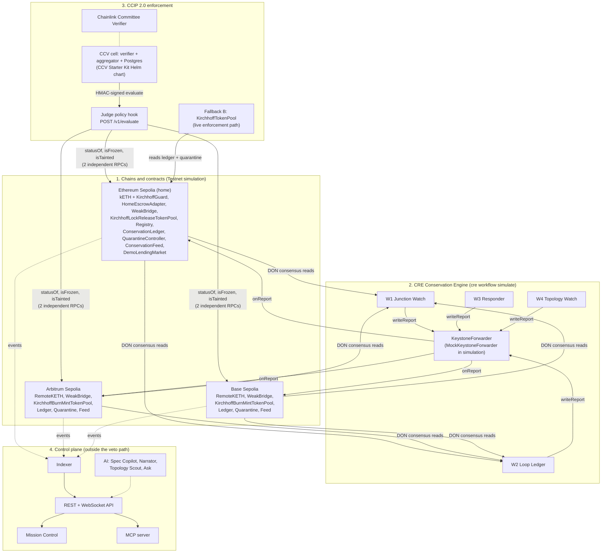

# KIRCHHOFF

**Every bridge checks who signed. KIRCHHOFF checks if the money adds up.**

KIRCHHOFF is a Cross-Chain Verifier (CCV) for Chainlink CCIP 2.0 with a Chainlink CRE Conservation Engine behind it.
It refuses a token transfer when the token's supply stops adding up across chains, whichever bridge broke it.

> **Status, read this first.** Everything on public networks below is a **Testnet simulation** (Ethereum Sepolia,
> Arbitrum Sepolia, Base Sepolia). Two fallbacks are in use and we say so plainly:
>
> 1. **CCV live attestation is not onboarded yet.** Our CCV cell (verifier + aggregator + Judge policy hook) runs in a
>    local k3d cluster, but our CCV resolver is not deployed and kETH's pools do not require it yet
>    ([ccv/STATUS.md](ccv/STATUS.md)). The live CCIP enforcement path is **Fallback B**: `KirchhoffTokenPool`, our
>    CCIP 2.0 token pools that revert inside `lockOrBurn` / `releaseOrMint` (PRD section 9).
> 2. **CRE deploy access is not enabled for our org** (`cre whoami`: `Deploy Access: Not enabled`). The four
>    workflows run with `cre workflow simulate`, which is the path PRD section 8 sanctions. Simulation reports reach
>    the ledgers through Chainlink's `MockKeystoneForwarder`, so the testnet ledgers are in `simulation` forwarder mode.

## Live

| What | URL |
| --- | --- |
| Mission Control (read-only, Vercel `sin1`) | https://kirchhoff-two.vercel.app |
| Public API (Vercel `sin1`, SSE stream) | https://kirchhoff-api.vercel.app (`/healthz`, `/v1/tokens`, `/v1/tokens/kETH/status`) |
| Repository | https://github.com/Adwaitbytes/kirchhoff-ccv |
| CI (typecheck, lint, tests with a Postgres 17 service, forge) | [GitHub Actions](https://github.com/Adwaitbytes/kirchhoff-ccv/actions), green on `6ad7ab8` ([run 37393797827](https://github.com/Adwaitbytes/kirchhoff-ccv/actions/runs/37393797827)) |

Both deployments answer from Vercel `sin1`. The live read model mirrors the fresh deployment's ledgers
(`0x3C1DE69BA8E3A337cFe44Ee16696B3bC7B8613aA` on all three chains) through an indexer that follows the three testnets
continuously into Neon (Singapore); the API served it at Sepolia block 11856439 on 2026-10-07.

## Contents

- [The problem](#the-problem)
- [The two rules](#the-two-rules)
- [Architecture](#architecture)
- [How we use Chainlink CRE and CCIP](#how-we-use-chainlink-cre-and-ccip)
- [Deployed contracts (Testnet simulation)](#deployed-contracts-testnet-simulation)
- [Testnet transactions (Testnet simulation)](#testnet-transactions-testnet-simulation)
- [CRE workflows](#cre-workflows)
- [Repository layout](#repository-layout)
- [Quickstart (local)](#quickstart-local)
- [Reproduce the Kelp Replay](#reproduce-the-kelp-replay)
- [Test results](#test-results)
- [Measured latency](#measured-latency)
- [Roadmap and business](#roadmap-and-business)
- [Security model](#security-model)
- [What KIRCHHOFF does not protect against](#what-kirchhoff-does-not-protect-against)
- [Honesty notes](#honesty-notes)
- [Docs](#docs)

## The problem

On April 18, 2026, attackers forged a LayerZero message and released about 116,500 rsETH, worth about $292M, from
Kelp DAO's bridge ([Crypto Times](https://www.cryptotimes.io/2026/05/18/crypto-bridge-hacks-top-328m-in-2026-as-cross-chain-exploits-accelerate/)).
The forged message passed because the bridge was configured with a single verifier
([Decrypt](https://decrypt.co/379463)). rsETH holders on 20 chains lost value without ever touching Kelp
([Phemex](https://phemex.com/blogs/defi-hacks-2026-bridge-exploits-explained)), and bridge exploits drained over
$340M across 14 incidents in 2026
([DexTools / PeckShield](https://www.dextools.io/news/crypto-bridge-hacks-340-million-2026-peckshield-alert-june-2026-de)).

Every one of those bridges checked who signed the message. None checked whether the message was economically
possible. A simple sum would have exposed the fake supply the moment it appeared.

CCIP 2.0 (launched September 28, 2026) lets an issuer require its own CCV next to Chainlink's Committee Verifier
([Chainlink](https://chain.link/blog/introducing-ccip-2-0)). KIRCHHOFF is that CCV, and its only job is conservation.

## The two rules

Named after Kirchhoff's circuit laws: what flows out of a junction must equal what flows in.

**Junction Rule (per message, exact).** Every credit `c` (a mint or a release) on any chain must match exactly one
debit `d` (a burn or a lock) such that:

1. `d.messageId == c.messageId` and `d.srcChain == c.claimedSrcChain`
2. `d.token == spec.tokenOn(d.srcChain)` and `d.amount == c.amount` (in canonical base units)
3. `d.recipient == c.recipient` when the bridge carries the recipient
4. `d` is at or below the source chain's required confidence (finalized by default)
5. `d` has not already been consumed by an earlier credit (no double credit, no replay)

A credit with no matching debit on a final source block is `BROKEN` with `DEBIT_NOT_FOUND`. This catches the Kelp
pattern on the first transaction. Code: [`engine/src/junction.ts`](engine/src/junction.ts).

**Loop Rule (global, per epoch).** For a lock-and-release token, with `E` the home escrow at pinned block `b_H`,
`S_i` the remote supply on chain `i` at pinned block `b_i`, `F_out` locked but not yet minted, `F_in` burned but
not yet released, and tolerance `τ` (0 by default):

```
Δ = E_H(b_H) - ( Σ_i S_i(b_i) + F_out + F_in )        BROKEN  iff  Δ < -τ
```

For burn-and-mint tokens: `Σ_i S_i(b_i) + F <= min(I_net, R) + τ`, where `I_net` is net authorized issuance and `R`
is the Proof of Reserve answer. In-flight amounts come from message matching by id, never from snapshot timing.
A donation to the escrow only raises Δ (surplus). Code: [`engine/src/loop.ts`](engine/src/loop.ts).

Both rules live in one pure TypeScript library, `@kirchhoff/engine` (bigint only, no clock, no randomness, no
network), which runs inside the CRE workflows (compiled to WASM), the Judge and the backtester, so all three agree.

## Architecture

Four layers. Only the first three can produce or enforce a verdict; the control plane can be switched off and every
verdict still works. Full diagram and the Flow B sequence: [docs/ARCHITECTURE.md](docs/ARCHITECTURE.md).



`scripts/no-ai-in-veto-path.sh` runs in CI and fails the build if a model SDK or provider shows up in `engine/`,
`judge/`, `contracts/` or `workflows/`.

## How we use Chainlink CRE and CCIP

### CRE: the Conservation Engine

Four TypeScript workflows (`@chainlink/cre-sdk` 1.23.0, CRE CLI v1.36.0) do all the computing
([workflows/README.md](workflows/README.md)).

| Workflow | Triggers | CRE capabilities used | Writes (via `writeReport` to the forwarder) |
| --- | --- | --- | --- |
| W1 Junction Watch | EVM Log trigger per chain on every credit event (WeakBridge / HomeEscrowAdapter `Released`, CCIP OffRamp `ExecutionStateChanged`) | `headerByNumber` (finalized pin), `callContract` (`debitOf` at the pin, `isConsumed`), `filterLogs` (evidence window), `getTransactionReceipt` (CCIP credits) | `BREACH` to the ledger on all three chains in the same run |
| W2 Loop Ledger | Cron `*/30 * * * * *` plus EVM Log triggers on supply-changing `Transfer` events | `headerByNumber` per chain, one Multicall3 `callContract` per chain at the pinned block (incl. the Proof of Reserve `latestRoundData` when the spec has a feed), `filterLogs` for in-flight matching | `EPOCH` (CONSERVED or DRIFT, settled ids), `BREACH` (`LOOP_DEFICIT`, `RESERVE_SHORTFALL`), `RECOVERY_CHECK` |
| W3 Responder | EVM Log trigger on `BreachRecorded` (home ledger) | Multicall3 `callContract`, HTTP capability with `Idempotency-Key` = incident id, CRE secrets | `QUARANTINE_APPLIED` (tainted recipients) on every ledger whose active incident it is |
| W4 Topology Watch | EVM Log trigger on `SpecActivated`, Cron every 10 minutes, `RoleGranted(MINTER_ROLE)` on the remotes | `filterLogs` over `RoleGranted`, Multicall3 `hasRole`, registry `activeSpecHash`, TokenAdminRegistry `getPool`, pool `getRemotePools`, HTTP capability with CRE secrets | `EPOCH` DRIFT with `SPEC_MISMATCH` when the active spec differs from the compiled one, or a minter, pool or peer outside the spec appears; pages the issuer once per drift |

Reports reach `ConservationLedger.onReport(metadata, report)` only through the `KeystoneForwarder`
(`MockKeystoneForwarder` in simulation). `CREReceiver` keeps Chainlink's `ReceiverTemplate` metadata decoding and
replaces the single expected workflow id with an allowlist `workflowId -> (owner, name, allowed report types)`. Every
report carries the chain selector and the ledger address, so a report built for another chain or ledger is rejected.
A CRE report alone can never clear `BROKEN`: only the issuer Safe can start recovery.

Every run stays inside the CRE per-execution limits (15 EVM reads, 100 blocks per `filterLogs`); each run logs its
read budget, for example `W2 reads used 12/15` ([workflows/SIMULATION_LOG.md](workflows/SIMULATION_LOG.md)).
Workflow configs are generated from the KIRCH-SPEC by `engine/src/compile.ts`; nobody edits them by hand.

### CCIP 2.0: the verifier and the pools

- **CCV policy hook (the Judge).** Built against the chainlink-ccv policy hook OpenAPI v1 spec (copied verbatim into
  `judge/openapi/`). HMAC-SHA256 verified, two independent RPC providers per chain, 2 s budget, every reason code in
  PRD section 6. It runs inside a CCV cell built from the official CCV Starter Kit Helm chart (`ccv-cell` v0.8.0,
  verifier and aggregator images v0.13.0).
- **Fallback B, KirchhoffTokenPool.** `KirchhoffLockReleaseTokenPool` (home) and `KirchhoffBurnMintTokenPool`
  (remotes) subclass the unmodified CCIP 2.0.0 `LockReleaseTokenPool` / `BurnMintTokenPool` and override the
  validation choke points every `lockOrBurn` / `releaseOrMint` passes through. They allow only CONSERVED or DRIFT with
  a fresh status, no frozen lanes, and no tainted sender or receiver. kETH is registered as a Cross-Chain Token
  through the self-serve TokenAdminRegistry flow on all three testnets.
- **CCIP message matching.** CCIP 2.0.0 pool events carry no message id, so the `ccip_v2` adapter pairs
  `LockedOrBurned` with the OnRamp `CCIPMessageSent` in the same transaction, and `ReleasedOrMinted` with the OffRamp
  `ExecutionStateChanged` (docs/INTERFACES.md Revision 2).

## Deployed contracts (Testnet simulation)

Fresh deployment made inside the hackathon window, from [deployments/testnet.json](deployments/testnet.json) and
`deployments/testnet-{home,arb,base}.raw.json` (written by `demo/deploy-all.ts` through `contracts/script/Deploy.s.sol`).
Source verification was checked on 2026-10-07 through the Etherscan V2 API: all 26 KIRCHHOFF and demo contracts below
report verified source. Ledgers run in `simulation` forwarder mode (reports arrive through Chainlink's
`MockKeystoneForwarder` from `cre workflow simulate --broadcast`).

kETH `tokenId` = `keccak256("kETH")` = `0xe7cbc0ff4035309f71987d099a88ed33ef6bfd1a7d6c1050befb12561b95eb9c`.

### Ethereum Sepolia (home, chain id 11155111, selector 16015286601757825753)

| Contract | Address |
| --- | --- |
| KirchhoffRegistry | [`0x48b5a12B107dd849DD390012aC643F0a29D685AB`](https://sepolia.etherscan.io/address/0x48b5a12B107dd849DD390012aC643F0a29D685AB#code) |
| ConservationLedger | [`0x3C1DE69BA8E3A337cFe44Ee16696B3bC7B8613aA`](https://sepolia.etherscan.io/address/0x3C1DE69BA8E3A337cFe44Ee16696B3bC7B8613aA#code) |
| QuarantineController | [`0xBf152550ed1D8E2DDc05E8427967FcDe552C7ed9`](https://sepolia.etherscan.io/address/0xBf152550ed1D8E2DDc05E8427967FcDe552C7ed9#code) |
| ConservationFeed | [`0x937C381243CA23664bd858fc342fEa7801De5E8e`](https://sepolia.etherscan.io/address/0x937C381243CA23664bd858fc342fEa7801De5E8e#code) |
| KirchhoffGuard | [`0x071b452B45bF9978B79A7A953F6cE8a258A444ed`](https://sepolia.etherscan.io/address/0x071b452B45bF9978B79A7A953F6cE8a258A444ed#code) |
| KirchhoffTokenPool (Fallback B) | [`0xbD6164B658CfE68AD28ffc8053962940d87f20aB`](https://sepolia.etherscan.io/address/0xbD6164B658CfE68AD28ffc8053962940d87f20aB#code) |
| ERC20LockBox (CCIP escrow) | [`0x12BdA4cA9F7C9Ae72B0F7Dae6B85e1a7973D1c08`](https://sepolia.etherscan.io/address/0x12BdA4cA9F7C9Ae72B0F7Dae6B85e1a7973D1c08#code) |
| kETH (demo token) | [`0x89767Dab88D356DED2f5e5D153644E08505981c8`](https://sepolia.etherscan.io/address/0x89767Dab88D356DED2f5e5D153644E08505981c8#code) |
| HomeEscrowAdapter (demo) | [`0x528Df7b17dc1702772cBc6a2ABD8eBA4E4260191`](https://sepolia.etherscan.io/address/0x528Df7b17dc1702772cBc6a2ABD8eBA4E4260191#code) |
| WeakBridge (demo, single-key verifier) | [`0x012F441246C0C5318B80B58c9440AD25516331a7`](https://sepolia.etherscan.io/address/0x012F441246C0C5318B80B58c9440AD25516331a7#code) |
| DemoLendingMarket (demo) | [`0x158dB8681e8E5b0f5a738129CED6FF7EbDA8C225`](https://sepolia.etherscan.io/address/0x158dB8681e8E5b0f5a738129CED6FF7EbDA8C225#code) |
| DemoUSD (demo) | [`0xec5b7E4373c0013559162D5c51fE12F5ccb18cC4`](https://sepolia.etherscan.io/address/0xec5b7E4373c0013559162D5c51fE12F5ccb18cC4#code) |
| MockKeystoneForwarder (Chainlink, simulation) | [`0x15fC6ae953E024d975e77382eEeC56A9101f9F88`](https://sepolia.etherscan.io/address/0x15fC6ae953E024d975e77382eEeC56A9101f9F88#code) |

### Arbitrum Sepolia (remote, chain id 421614, selector 3478487238524512106)

| Contract | Address |
| --- | --- |
| ConservationLedger | [`0x3C1DE69BA8E3A337cFe44Ee16696B3bC7B8613aA`](https://sepolia.arbiscan.io/address/0x3C1DE69BA8E3A337cFe44Ee16696B3bC7B8613aA#code) |
| QuarantineController | [`0xBf152550ed1D8E2DDc05E8427967FcDe552C7ed9`](https://sepolia.arbiscan.io/address/0xBf152550ed1D8E2DDc05E8427967FcDe552C7ed9#code) |
| ConservationFeed | [`0x937C381243CA23664bd858fc342fEa7801De5E8e`](https://sepolia.arbiscan.io/address/0x937C381243CA23664bd858fc342fEa7801De5E8e#code) |
| KirchhoffGuard | [`0x071b452B45bF9978B79A7A953F6cE8a258A444ed`](https://sepolia.arbiscan.io/address/0x071b452B45bF9978B79A7A953F6cE8a258A444ed#code) |
| KirchhoffTokenPool (Fallback B) | [`0x89767Dab88D356DED2f5e5D153644E08505981c8`](https://sepolia.arbiscan.io/address/0x89767Dab88D356DED2f5e5D153644E08505981c8#code) |
| RemoteKETH (demo token) | [`0x48b5a12B107dd849DD390012aC643F0a29D685AB`](https://sepolia.arbiscan.io/address/0x48b5a12B107dd849DD390012aC643F0a29D685AB#code) |
| WeakBridge (demo, single-key verifier) | [`0x50db1f9fDc7c015A46d12E090C2C46B4C842D779`](https://sepolia.arbiscan.io/address/0x50db1f9fDc7c015A46d12E090C2C46B4C842D779#code) |
| MockKeystoneForwarder (Chainlink, simulation) | [`0xD41263567DdfeAd91504199b8c6c87371e83ca5d`](https://sepolia.arbiscan.io/address/0xD41263567DdfeAd91504199b8c6c87371e83ca5d#code) |

### Base Sepolia (remote, chain id 84532, selector 10344971235874465080)

| Contract | Address |
| --- | --- |
| ConservationLedger | [`0x3C1DE69BA8E3A337cFe44Ee16696B3bC7B8613aA`](https://sepolia.basescan.org/address/0x3C1DE69BA8E3A337cFe44Ee16696B3bC7B8613aA#code) |
| QuarantineController | [`0xBf152550ed1D8E2DDc05E8427967FcDe552C7ed9`](https://sepolia.basescan.org/address/0xBf152550ed1D8E2DDc05E8427967FcDe552C7ed9#code) |
| ConservationFeed | [`0x937C381243CA23664bd858fc342fEa7801De5E8e`](https://sepolia.basescan.org/address/0x937C381243CA23664bd858fc342fEa7801De5E8e#code) |
| KirchhoffGuard | [`0x071b452B45bF9978B79A7A953F6cE8a258A444ed`](https://sepolia.basescan.org/address/0x071b452B45bF9978B79A7A953F6cE8a258A444ed#code) |
| KirchhoffTokenPool (Fallback B) | [`0x89767Dab88D356DED2f5e5D153644E08505981c8`](https://sepolia.basescan.org/address/0x89767Dab88D356DED2f5e5D153644E08505981c8#code) |
| RemoteKETH (demo token) | [`0x48b5a12B107dd849DD390012aC643F0a29D685AB`](https://sepolia.basescan.org/address/0x48b5a12B107dd849DD390012aC643F0a29D685AB#code) |
| WeakBridge (demo, single-key verifier) | [`0x50db1f9fDc7c015A46d12E090C2C46B4C842D779`](https://sepolia.basescan.org/address/0x50db1f9fDc7c015A46d12E090C2C46B4C842D779#code) |
| MockKeystoneForwarder (Chainlink, simulation) | [`0x82300bd7c3958625581cc2F77bC6464dcEcDF3e5`](https://sepolia.basescan.org/address/0x82300bd7c3958625581cc2F77bC6464dcEcDF3e5#code) |

Issuer Safe (2 of 3, same address on all three chains): `0xBc614b7965e4A6c3B3cDB73A1A377434460585aA`.

Active kETH spec hash: `0xeb44896b07b91777fd04a9826122e927f5d87d1097be7cea81944fc4e39774da` (120 s testnet recovery
timelock, proposed by the issuer Safe and activated through the KirchhoffRegistry timelock).

## Testnet transactions (Testnet simulation)

One complete `pnpm --filter @kirchhoff/demo e2e --network testnet` run on the fresh deployment, 2026-10-07 05:32 to
07:03 UTC, result **e2e PASSED**: the pre-run recovery of an earlier attempt, a CONSERVED baseline, the forged
WeakBridge credit, W1 BREACH on all three ledgers in one CRE run, W3 quarantine, the onchain refusals, the W2 Loop Rule
epoch asserting delta -116,500 kETH, and the reset back to CONSERVED. Every ledger write is a CRE report from
`cre workflow simulate --broadcast`; Safe rows are 2 of 3 issuer Safe transactions; refusals are mined, reverted
transactions with their revert reason.

| Step | Chain | What happened | Revert reason | Transaction |
| --- | --- | --- | --- | --- |
| recovery-check | home | EPOCH written on home by CRE |  | [`0x30e5373b...376e`](https://sepolia.etherscan.io/tx/0x30e5373b995cd8987e55a8616382fd9b4e4ba51ad379e56a546c6f3fa9c5376e) |
| recovery-check | arb | EPOCH written on arb by CRE |  | [`0x67a92177...904f`](https://sepolia.arbiscan.io/tx/0x67a9217741654ab6beee209e1d32d2ce10cdd72a683f574e3b40a9c6c9b1904f) |
| recovery-check | base | RECOVERY_CHECK written on base by CRE |  | [`0xe0bb45c9...a569`](https://sepolia.basescan.org/tx/0xe0bb45c9296142cadb53761914765f35868d9bef12284773c8ba821104faa569) |
| baseline-epoch | home | EPOCH written on home by CRE |  | [`0x3d820d3b...8c47`](https://sepolia.etherscan.io/tx/0x3d820d3b901e0175d6a07d01e5e886821cf0262ac7c8184212465cda45458c47) |
| baseline-epoch | arb | EPOCH written on arb by CRE |  | [`0x1b996cbb...8746`](https://sepolia.arbiscan.io/tx/0x1b996cbb8dcbe2979e324072340bd465b6b2fc7d03a518b1dcae4dc311588746) |
| baseline-epoch | base | RECOVERY_CHECK written on base by CRE |  | [`0xb367d4d4...1c28`](https://sepolia.basescan.org/tx/0xb367d4d45e3975500e668f2bbac2bbbaaddc5aab113ff2da71f8287dda941c28) |
| forge-credit | home | released 116,500 kETH to attacker with no debit |  | [`0x6367b107...1d4a`](https://sepolia.etherscan.io/tx/0x6367b1078c2b7662378c56ed5a756f87a0f3f61697b7c1b35d5cf634befd1d4a) |
| breach | home | BREACH written on home by CRE |  | [`0xddbdd934...6e70`](https://sepolia.etherscan.io/tx/0xddbdd934f11527a879f6c8b0e89db6ae8784d59549906bd2f0daa92431f66e70) |
| breach | arb | BREACH written on arb by CRE |  | [`0x2381e453...db14`](https://sepolia.arbiscan.io/tx/0x2381e4531ad6eff6fce46c0da2ef9d3a497d5f214f3924227d070ee838bddb14) |
| breach | base | BREACH written on base by CRE |  | [`0x3e0afa11...5015`](https://sepolia.basescan.org/tx/0x3e0afa11fddd16776213b80c6c770b6022f740103746a91cd26cab5a7ee95015) |
| quarantine | home | QUARANTINE_APPLIED written on home by CRE |  | [`0xa0bed840...9b9f`](https://sepolia.etherscan.io/tx/0xa0bed840ae6b98455b7a0ae90972f19f7eae7ba720913431cfd8f1f2bdde9b9f) |
| quarantine | arb | QUARANTINE_APPLIED written on arb by CRE |  | [`0xcd2a55fc...a75d`](https://sepolia.arbiscan.io/tx/0xcd2a55fca60fcc9e1d0fe446ee514519686a9d5981c8b46651c223f82c70a75d) |
| quarantine | base | QUARANTINE_APPLIED written on base by CRE |  | [`0x594b0975...6ad1`](https://sepolia.basescan.org/tx/0x594b0975fa4f5271477ec4777e3c50c1c586ec574bbe7e4105beae96717f6ad1) |
| refuse-ccip | home | attacker ccipSend reverted onchain (Router pulls tokens first: KirchhoffGuard) | `SenderTainted(0xD04C90127279E40dba7477dc` | [`0xf663e2bd...6345`](https://sepolia.etherscan.io/tx/0xf663e2bda9e6ff18746648f1989de02985f19d11222430cd757ec749a86e6345) |
| refuse-ccip-pool | home | ccipSend reverted inside KirchhoffTokenPool (lanes frozen) | `TokenNotConserved(0xe7cbc0ff4035309f7198` | [`0x4380c01f...6ea9`](https://sepolia.etherscan.io/tx/0x4380c01f3b0d442e4657329ca7af79938b89f32cd0755c5a2b0c5357d35a6ea9) |
| refuse-guard | home | home transfer reverted (KirchhoffGuard) | `SenderTainted(0xD04C90127279E40dba7477dc` | [`0xd299af11...fa10`](https://sepolia.etherscan.io/tx/0xd299af1166b323552a95c9ebb8ed8bb116f436758615e5ef62306368bf56fa10) |
| refuse-borrow | home | borrow reverted (CollateralBroken) | `CollateralBroken()` | [`0x2e805c6c...cbcc`](https://sepolia.etherscan.io/tx/0x2e805c6cdd89166861b2a3b2ad82651c62e6a52bd38080a1560700aae58bcbcc) |
| loop-epoch | home | BREACH written on home by CRE |  | [`0x6965d977...5837`](https://sepolia.etherscan.io/tx/0x6965d977fe951dd8c7309401ac1f525118734f4b2286970abf12c4dd4a045837) |
| loop-epoch | arb | BREACH written on arb by CRE |  | [`0x5805b9df...0ea3`](https://sepolia.arbiscan.io/tx/0x5805b9dfe6299eeeb6019675db17bf31eee5d2c69230d9b84a2dd4d806460ea3) |
| loop-epoch | base | BREACH written on base by CRE |  | [`0xf8e47a57...cef1`](https://sepolia.basescan.org/tx/0xf8e47a57931325cf1673d83ead275bace6f7884d2b5927070bb001e699f2cef1) |
| resolve | home | issuer Safe resolved incident on home |  | [`0xf3a23094...96cc`](https://sepolia.etherscan.io/tx/0xf3a230946eae0eaf300d4db37acf2716f667720decdcf91997a460422f3896cc) |
| resolve | arb | issuer Safe resolved incident on arb |  | [`0xb7bc7383...869e`](https://sepolia.arbiscan.io/tx/0xb7bc7383393361132351bd11d5a0c22e2ef1a84d8147ef4d2b263da6a79f869e) |
| resolve | base | issuer Safe resolved incident on base |  | [`0xd7c2ace3...d8c0`](https://sepolia.basescan.org/tx/0xd7c2ace3bfc23778ec87826f68c8f21789729686f15e7af504061745e34ed8c0) |
| untaint | home | attacker untainted on home |  | [`0x79042689...60cc`](https://sepolia.etherscan.io/tx/0x79042689d61d0a2cfc07bf3e6c1038dbf5c90e72349475b5eec6a12aa67560cc) |
| untaint | arb | attacker untainted on arb |  | [`0xed80dda2...004d`](https://sepolia.arbiscan.io/tx/0xed80dda2c106195774aca1292600563058f3ed5b4b4df9eba73fe10cbaf0004d) |
| untaint | base | attacker untainted on base |  | [`0xfb2d17fe...6e7f`](https://sepolia.basescan.org/tx/0xfb2d17fee23101d713973bda799f2084dacd1f17d76f79a3dfdd513a8a206e7f) |
| rebalance | home | returned 116500000000000000000000 kETH to escrow; Δ back to 0 |  | [`0x81b95bf2...4674`](https://sepolia.etherscan.io/tx/0x81b95bf2f8a67bdb549d9ff2e821d486cec21f3e46045d7d7bc4bcbe33134674) |
| recovery-check | home | RECOVERY_CHECK written on home by CRE |  | [`0x332d9310...9b40`](https://sepolia.etherscan.io/tx/0x332d93107544647c3f4c1e80c6131bf4713d5ed965049a749b62e71ea7249b40) |
| recovery-check | arb | RECOVERY_CHECK written on arb by CRE |  | [`0x78101ce4...7c22`](https://sepolia.arbiscan.io/tx/0x78101ce473e3defe4712bf87908c652b1bd35c1ed47e1df5de62a7d6c80e7c22) |
| recovery-check | base | RECOVERY_CHECK written on base by CRE |  | [`0x8735e973...e0a8`](https://sepolia.basescan.org/tx/0x8735e973cb17b2343ac556222a335e802231091e9241a46f1e26f739931ee0a8) |

Measured on this run (`demo/e2e.ts` latency step): forged credit to BROKEN onchain via the Junction Rule in 1,236 s
and via the Loop Rule in 2,328 s. Both are dominated by waiting for the claimed source chain (Arbitrum Sepolia) and
Sepolia to finalize, because verdicts only read finalized blocks (PRD 14 threat 6); on three local chains the same
path takes 2 to 4 s after confidence (workflows/SIMULATION_LOG.md scenario 7). The reset took about 25 minutes for the
same reason; locally it takes 28.2 s (demo/E2E_LOG.md).

## CRE workflows

| Workflow | CRE workflow name | Directory |
| --- | --- | --- |
| W1 Junction Watch | `kirchhoff-w1-junction` | [workflows/w1-junction](workflows/w1-junction) |
| W2 Loop Ledger | `kirchhoff-w2-loop` | [workflows/w2-loop](workflows/w2-loop) |
| W3 Responder | `kirchhoff-w3-responder` | [workflows/w3-responder](workflows/w3-responder) |
| W4 Topology Watch | `kirchhoff-w4-topology` | [workflows/w4-topology](workflows/w4-topology) |

**Workflow ids.** Live deploy access is pending, so there are no DON workflow ids yet. In simulation the CRE CLI uses
the fixed workflow id `0x1111111111111111111111111111111111111111111111111111111111111111` and owner
`0xaaaaaaaaaaaaaaaaaaaaaaaaaaaaaaaaaaaaaaaa`, and the simulation-mode ledgers pin exactly that metadata
([contracts/README.md](contracts/README.md), "Deploying"). For a live deploy, CRE allows 3 workflows per org, so W4's
handlers run inside W2 (docs/INTERFACES.md Revision 2, item 6); production ids come from `cre workflow hash` and are
passed to `Deploy.s.sol` as `WORKFLOW_ID_W1/W2/W3`.

## Repository layout

```
contracts/   Foundry: production suite, Fallback B pools, demo suite (Testnet simulation), tests, deploy scripts
engine/      @kirchhoff/engine: Junction and Loop rules, status machine, Judge core, adapters, spec compiler
workflows/   CRE workflows W1 to W4, generated configs, scenario harness, SIMULATION_LOG.md
judge/       CCV policy hook service (POST /v1/evaluate), load and chaos results
ccv/         CCV Starter Kit Helm values per cell, k8s manifests, cell scripts, STATUS.md
indexer/     Event indexer to Postgres (UI read model only) and the notifier
api/         REST + WebSocket API, Attack Lab runner, internal verdict ingest
ai/          Spec Copilot, Incident Narrator, Topology Scout, Ask KIRCHHOFF, eval suite
mcp/         MCP server (stdio and Streamable HTTP, read-only tools)
sdk/         @kirchhoff/sdk
web/         Mission Control (Next.js 15)
demo/        deploy-all, seed, attack-kelp-replay, reset, e2e, verify
deployments/ Addresses per network
docs/        PRD, frozen interfaces, research notes, architecture
```

## Quickstart (local)

Requirements: Node 22 or later (CI uses 24), pnpm, Foundry, Bun (for CRE), the CRE CLI logged in (`cre login`),
Docker for Postgres.

```bash
cp .env.example .env          # fill in, or run: make wallets && make secrets
make check-creds              # green/red table of every credential
make install                  # pnpm install + contracts npm ci
make anvil                    # 3 local chains: home 8545/31337, arb 8546/31338, base 8547/31339
make deploy-local             # pnpm --filter @kirchhoff/demo deploy-all --network local
pnpm --filter @kirchhoff/demo e2e --network local   # full Kelp Replay with assertions, then reset
```

Run the whole test suite with `make test` (pnpm workspaces plus `forge test`) and the engine coverage gate with
`make coverage`.

## Reproduce the Kelp Replay

Labeled **Testnet simulation** throughout. The forgery is a WeakBridge credit signed by the bridge's single
verifier key with no matching burn. It reproduces the effect of the Kelp forgery (a credit with no debit), not
LayerZero's exact bug.

### Local (3 Anvil chains)

```bash
make anvil
make deploy-local
pnpm --filter @kirchhoff/demo seed --network local      # Flow A: normal CCIP and WeakBridge traffic, W2 baseline
pnpm --filter @kirchhoff/demo attack --network local    # Flow B: the Kelp Replay
pnpm --filter @kirchhoff/demo reset --network local     # back to a clean, conserved state
```

What `attack` does, step by step (code: [demo/src/attack.ts](demo/src/attack.ts)):

1. The attacker submits a WeakBridge credit for 116,500 kETH signed by the single verifier key, with no burn on any
   chain. `HomeEscrowAdapter` releases 116,500 kETH on the home chain.
2. W1 runs with `cre workflow simulate --broadcast` on that `Released` log, finds no debit (`debitOf(id)` at the
   finalized pin is zero) and writes `BREACH` (`DEBIT_NOT_FOUND`) to all three ledgers in the same run.
3. W3 runs on `BreachRecorded`: `QUARANTINE_APPLIED` on all three ledgers, attacker tainted, lanes frozen, the
   Conservation Feed answers QUARANTINED.
4. The attacker tries to move kETH to Base Sepolia through CCIP: the Fallback B pool refuses. Today the script
   calls the pool's public `kirchhoffCheck(sender, receiver)`, the same check `lockOrBurn` runs, and asserts the
   revert. A full `ccipSend` through the router is pending (see the traceability matrix). The script also builds the
   policy hook request for this message; the Judge answers it FAIL `TOKEN_QUARANTINED` (Fallback C, Judge replay).
5. The attacker tries a plain kETH transfer: `KirchhoffGuard` reverts. `DemoLendingMarket.borrow()` reverts
   `CollateralBroken()`.
6. W2's next epoch computes Δ = -116,500 kETH (`LOOP_DEFICIT`).

`--reports direct` writes the identical report bytes through each chain's MockKeystoneForwarder instead of running
the CRE simulator. It is a named fallback for machines without the CRE CLI, not the default.

The Attack Lab (`/lab` in Mission Control) runs the same script through the API and streams each step with its
explorer link.

### Public testnets

```bash
make deploy-testnets          # idempotent: reuses every recorded address that still has code
pnpm --filter @kirchhoff/demo spec --network testnet      # issuer Safe proposes and activates the kETH spec (10 min timelock)
pnpm --filter @kirchhoff/workflows gen-config --target staging
pnpm --filter @kirchhoff/demo seed --network testnet
make e2e                      # demo e2e --network testnet: resets first when it starts from a contained state, then BREACH on 3 chains, CCIP refusal, Guard and borrow reverts, Δ = -116,500 kETH
make reset                    # contains any dangling incident, Safe resolutions, rebalance, RECOVERY_CHECK
```

Optional: set `ALCHEMY_API_KEY` in `.env`. CRE simulation then tries the keyed Alchemy endpoint first, before
publicnode, the official chain RPCs and the Tenderly gateway; keyless endpoints rate-limit parallel reads with HTTP
429 (`demo/src/cre.ts`). To stand in for the DON cron while deploy access is pending, the gas-capped runner triggers
W2 on an interval and W1 / W3 on new credit and breach logs:

```bash
pnpm --filter @kirchhoff/workflows runner --target staging --interval 90 --max-sepolia-eth 0.02 [--rounds N]
```

Every step prints the explorer link of its transaction. Pacing: a finalized CCIP message on Ethereum Sepolia reaches
a CCV verifier roughly 13 to 17 minutes after the send ([docs/research/ccip.md](docs/research/ccip.md) section 8).

## Test results

TypeScript and Foundry counts are from the green GitHub CI run
[37393797827](https://github.com/Adwaitbytes/kirchhoff-ccv/actions/runs/37393797827) on commit `6ad7ab8` (2026-10-06,
`pnpm -r test` with a Postgres 17 service, the engine coverage gate, `forge test -vv`). Playwright counts are from the
local report of 2026-10-06 (commit `230054a`); Playwright does not run in CI.

| Package | Command | Result |
| --- | --- | --- |
| Engine | `pnpm --filter @kirchhoff/engine test` | 251 passed (14 files) |
| Engine coverage | `pnpm --filter @kirchhoff/engine coverage` | 100% statements, branches, functions and lines (CI gate); 2026-10-05 local run: 894/894, 586/586, 203/203, 736/736 |
| Engine property test | `engine/test/property.test.ts` "holds over 10,000 random histories" | 10,000 runs (`numRuns: 10_000`): every forgery flagged, zero false flags on valid traffic |
| Contracts | `cd contracts && forge test` | 150 passed, 0 failed (10 suites: unit, fuzz at 1024 runs, invariants at 256 runs x depth 64, real KeystoneForwarder signature path) |
| Workflows | `pnpm --filter @kirchhoff/workflows test` | 54 passed |
| Workflows, six PRD scenarios plus the latency run | `pnpm --filter @kirchhoff/workflows scenarios` (`cre workflow simulate --broadcast` on 3 Anvil chains) | 7 / 7 PASS ([SIMULATION_LOG.md](workflows/SIMULATION_LOG.md), run 2026-10-05) |
| Workflows on public testnets | `cre workflow simulate --target staging` | W2 `--broadcast` EPOCH on 3 testnets; W4 cron and `SpecActivated` `findings=0` at 14/15 reads ([SIMULATION_LOG.md](workflows/SIMULATION_LOG.md) "Staging") |
| Judge | `pnpm --filter @kirchhoff/judge test` | 96 passed, 3 skipped (the skipped ones need `JUDGE_LIVE=1` and live Sepolia RPCs) |
| AI | `pnpm --filter @kirchhoff/ai test` | 33 passed |
| API | `pnpm --filter @kirchhoff/api test` | 28 passed |
| Indexer | `pnpm --filter @kirchhoff/indexer test` | 10 passed |
| SDK | `pnpm --filter @kirchhoff/sdk test` | 8 passed |
| MCP | `pnpm --filter @kirchhoff/mcp test` | 6 passed |
| Demo | `pnpm --filter @kirchhoff/demo test` | 8 passed |
| Web | Playwright, `web/e2e` (12 specs) | 124 / 124 passed: Mission Control, Incident Room, Attack Lab, Onboarding, Ops source links, stage snapshots, responsive, axe WCAG 2.2 AA on 11 routes in both themes, keyboard-only navigation |
| AI evals | `ai/eval/run.ts` ([RESULTS.md](ai/eval/RESULTS.md), 2026-10-05) | provenance 100%, field accuracy 19 / 19, narrator citations 100%, prompt injection 0 of 10 misuse |
| No AI in veto path | `bash scripts/no-ai-in-veto-path.sh` | OK |

## Measured latency

Every number here was measured; the file that holds the raw output is linked.

| What | Result | Source |
| --- | --- | --- |
| Judge at 100 rps, in-process stub RPCs (k6, 60 s) | p50 3.64 ms, p99 6.13 ms, 0 of 6001 failed | [judge/load/RESULTS.md](judge/load/RESULTS.md) run A |
| Judge at 100 rps, real contracts on Anvil, two independent providers, quiet machine (k6, 60 s) | p50 4.26 ms, **p99 9.31 ms**, 0 of 6001 failed (target under 300 ms) | [judge/load/RESULTS.md](judge/load/RESULTS.md) run D (runs B and C, at machine load 15 to 54, are kept there for the record) |
| Judge, single signed request against the live testnet deployment | 21.3 to 26.6 ms | [judge/README.md](judge/README.md) "Live testnet check" |
| Judge debit lookup through two keyless public Sepolia RPCs | 397 to 677 ms per message | [judge/load/RESULTS.md](judge/load/RESULTS.md) "Against real testnet RPCs" |
| Judge under chaos (provider killed, W2 paused) | every answer inside 11 ms, PENDING as HTTP 503 | [judge/CHAOS.md](judge/CHAOS.md) |
| Forged credit to BREACH | same W1 run as the credit event (scenario 3) | [workflows/SIMULATION_LOG.md](workflows/SIMULATION_LOG.md) |
| Loop Rule breach to BROKEN onchain (scenario 7, Anvil, 1 s blocks) | BREACH mined 2 / 3 / 4 s after confidence on home / arb / base; single-node simulation, excludes DON trigger delivery | [workflows/SIMULATION_LOG.md](workflows/SIMULATION_LOG.md) scenario 7 |
| `reset` back to CONSERVED | 28.2 s on three local chains; about 25 min on public testnets, almost all of it waiting for Sepolia, Arbitrum and Base finality | [demo/E2E_LOG.md](demo/E2E_LOG.md); testnet run in "Testnet transactions" |
| Forged credit to BROKEN onchain on public testnets (passing e2e run, 2026-10-07) | Junction Rule 1,236 s, Loop Rule 2,328 s, dominated by source-chain finality | "Testnet transactions" above (`demo/e2e.ts` latency step) |
| Spec Copilot onboarding of kETH on testnet | 111.6 s, 49 of 49 fields, validated first draft (target under 10 min) | [ai/eval/TESTNET_ONBOARDING.md](ai/eval/TESTNET_ONBOARDING.md) |

## Roadmap and business

The hackathon build is the enforcement core. PRD section 18 sets the path after TOKEN2049; nothing below is shipped
yet unless it says so. Adoption starts in shadow mode (watch and alert, no veto) and moves to enforcement once an issuer
has seen zero false alarms on its own traffic.

| Phase | Window | Ships | Exit criteria |
| --- | --- | --- | --- |
| 0. Harden | Weeks 1 to 4 | Open-source engine and adapters, audit scoping, Chainlink Build application, CCV marketplace conversations | Audit firm booked, 2 issuer design partners signed |
| 1. Shadow | Months 2 to 3 | Mainnet monitoring for 2 design partners, LayerZero and Wormhole adapters, Incident Room in production | 60 days with zero false BROKEN on real traffic |
| 2. Enforce | Months 4 to 6 | 4-cell committee across independent operators, CCV marketplace listing, first enforced token | First token requiring the KIRCHHOFF CCV on mainnet lanes |
| 3. Feed | Months 6 to 9 | Conservation Feed integrated by lending markets and vault curators | 3 money markets reading the feed |
| 4. Institutional | Months 9 to 12 | Tokenized funds and deposits on CCIP 2.0 across public and private chains, dedicated cells for regulated issuers | First institutional issuer |

Bridge coverage grows by adapter: `layerzero_oft` (cut from the hackathon, required for v1), `wormhole_ntt`,
`op_standard_bridge` and `arbitrum_gateway` (long withdrawal windows through `maxDeliverySeconds`), and `issuer_mint`
for burn-and-mint tokens. Every adapter maps its events onto the engine's Debit and Credit shapes
(`engine/src/adapters`), so a new bridge is an adapter plus a backtest, not a new engine.

### Revenue lines (a hypothesis to validate with design partners)

| Line | Who pays | How |
| --- | --- | --- |
| CCV verification fee | Users of protected tokens, collected by CCIP | CCIP 2.0 lets third-party verifiers set their own fee on top of the base fee |
| Issuer subscription | Token issuers | Monitoring, Incident Room, Spec Copilot, backtests, on-call integrations |
| Feed SLA | Lending markets, curators | Public feed free; paid tier with SLA and support |
| Dedicated cells | Institutions | We operate isolated cells or license the Judge to their own operators |

### Where we sit

| Alternative | What it does | Why KIRCHHOFF is different |
| --- | --- | --- |
| CCIP Committee Verifier | Verifies message authenticity | We add an independent economic check and sit beside it, by design |
| Issuer-built CCVs | One issuer's own logic | A reusable product across issuers and bridges |
| Infra firms running CCVs | Operate verifiers for clients | Likely partners: they can run cells with our Judge |
| Other bridges' verifier networks | Check signatures on their own messages | Cannot see supply created on other bridges |
| Runtime monitoring firms | Alert on suspicious activity | Alerts do not veto; we refuse to sign |
| Chainlink Proof of Reserve | Proves reserves exist | Does not match credits to debits; W2 consumes it for backed tokens |

Go-to-market: first customers are issuers whose tokens move across many bridges and chains (LRTs, LSTs, wrapped BTC,
multi-chain stablecoins); the channel is Chainlink's CCV marketplace, audit firms and risk curators who require the
feed; the wedge is free shadow-mode monitoring with a public status page. The moat is the adapter library and backtest
corpus, the per-token zero-false-positive record, and the network effect of lending markets reading the feed.

## Security model

Design law: nothing we operate alone can produce a verdict. Verdicts come only from CRE DON consensus data, onchain
state, and a deterministic Judge that each CCV cell runs independently.

| Threat (PRD section 14) | Response in this repo |
| --- | --- |
| Forged message on a non-CCIP bridge (the Kelp pattern) | W1 Junction Rule, BREACH on every chain, lanes frozen, recipient tainted, feed flips |
| Forged or buggy CCIP message | Judge checks the source pool debit for the message id independently of the Committee Verifier |
| Compromised mint key minting with no message | W2 Loop Rule (`LOOP_DEFICIT`) and W4 unlisted-minter alert (`SPEC_MISMATCH`) |
| Replay or double credit | Junction consumed set (`DOUBLE_CREDIT`), consumed ids recorded on the ledger |
| Lying or eclipsed RPC | DON consensus in CRE; two independent providers per Judge, disagreement is HTTP 503 (retry) |
| Chain reorg | Finalized confidence by default |
| Spec poisoning | Issuer Safe plus timelock (48 h in production, 10 minutes on testnet) |
| Report replay across chains or ledgers | chain selector and ledger address in every report, enforced by the ledger |
| KIRCHHOFF operator compromise | Operator cannot release containment; only the issuer Safe can resolve. Production needs 3 of 4 independent cells |
| Malicious AI suggestion or prompt injection | No write tools, provenance required, 10-case injection suite with 0 misuse |

## What KIRCHHOFF does not protect against

- Theft of real assets that keeps supply conserved, for example a social-engineered admin draining a protocol's own
  vault.
- DEX price manipulation, phishing, or bugs in lending logic.
- Swaps an attacker makes in the same block as the forged release, unless the token uses KirchhoffGuard.
- The first fraudulent release on a bridge KIRCHHOFF does not sit on. It contains it within one CRE run; it cannot
  undo it.

## Honesty notes

- **Testnet simulation.** All public deployments are testnet demos. kETH, RemoteKETH, WeakBridge, HomeEscrowAdapter,
  DemoLendingMarket and DemoUSD are demo contracts, labeled `TESTNET SIMULATION ONLY` in their NatSpec.
- **The forgery is a WeakBridge single-key signature.** We sign a WeakBridge credit with its one verifier key and no
  matching burn. That reproduces the effect of the Kelp exploit, not LayerZero's bug.
- **Fallback B is the live CCIP enforcement path.** The CCV cell runs one cell (threshold 1) in a local k3d cluster
  with the Judge wired as its policy hook. It cannot attest kETH messages until our CCV resolver is deployed, kETH's
  pools require it (`applyCCVConfigUpdates`, not wired yet), and the aggregator is reachable over public TLS. Indexer
  onboarding is not self-serve, so messages would be executed with `ccip-cli manual-exec`.
- **CRE runs in simulation.** Deploy access is not enabled for our org. Simulation is single node, and its forwarder
  is Chainlink's permissionless `MockKeystoneForwarder`, so a simulation-mode ledger can be written by anyone who
  forges the simulator's metadata. The production `KeystoneForwarder` path (DON signatures) is covered by
  `contracts/test/ForwarderIntegration.t.sol`.
- **Judge latency target.** p99 under 300 ms at 100 rps is met with stub RPCs and missed on a contended laptop with
  Anvil backends. Both results are reported.
- **Live read model lags.** The live Mission Control and API serve the indexed testnet mirror; the indexer is not
  running continuously, so the live pages can trail the ledgers (last indexed Sepolia block 11850609).
- **Notifier.** Telegram, Slack and PagerDuty pages are tested against mocked endpoints; no channel secrets are
  configured, so no live page has been delivered.
- **AI** never decides a verdict. The AI provider used for the evals is Claude through OpenRouter, temperature 0.

## Docs

- [PRD](docs/PRD.md) and [traceability matrix](PRD_TRACEABILITY.md)
- [Architecture and Flow B sequence](docs/ARCHITECTURE.md)
- [Frozen interfaces, incl. Revision 2](docs/INTERFACES.md)
- Research: [CRE](docs/research/cre.md), [CRE contracts](docs/research/cre-contracts.md), [CCIP](docs/research/ccip.md), [CCV](docs/research/ccv.md), [explorers](docs/research/explorers.md)
- [contracts/README.md](contracts/README.md), [workflows/README.md](workflows/README.md), [judge/README.md](judge/README.md), [ccv/README.md](ccv/README.md), [ccv/STATUS.md](ccv/STATUS.md)
- [Submission](SUBMISSION.md), [human tasks](HUMAN_TASKS.md), [credentials](CREDENTIALS_NEEDED.md)
