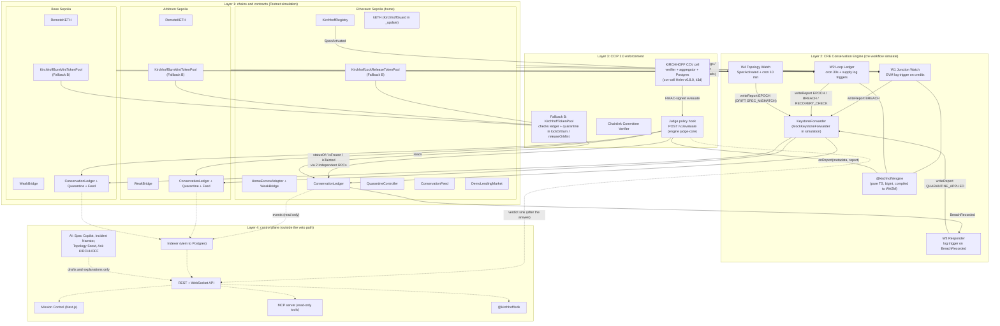

# KIRCHHOFF architecture

KIRCHHOFF has four layers. Only the first three can produce or enforce a verdict. The control plane (UI, API, AI,
MCP) mirrors onchain state and can be switched off without changing a single verdict (PRD section 5, design law).

Labels used below:

- **Testnet simulation**: everything on Ethereum Sepolia, Arbitrum Sepolia and Base Sepolia is a demo deployment. The
  WeakBridge is deliberately weak (one ECDSA key authorizes credits) so the Kelp pattern can be reproduced.
- **Fallback B**: the KIRCHHOFF CCV cell runs, but our CCV is not yet onboarded for live attestation on the CCIP
  testnet lanes. The live CCIP enforcement path is `KirchhoffTokenPool` (KirchhoffLockReleaseTokenPool on the home
  chain, KirchhoffBurnMintTokenPool on the remotes), which reverts inside `lockOrBurn` / `releaseOrMint`.
- **CRE simulation**: CRE deploy access is not enabled for our org, so W1 to W4 run with `cre workflow simulate`
  (the path PRD section 8 sanctions). Simulation reports reach the ledgers through Chainlink's
  `MockKeystoneForwarder`.

## System diagram



The dotted edges are the control plane. Nothing on a dotted edge can sign, write a report or change a status:
`scripts/no-ai-in-veto-path.sh` (run in CI) fails the build if a model SDK is imported by the engine, the
workflows, the Judge or the contracts.

## Flow B: the Kelp Replay, end to end

This is the sequence `demo/attack-kelp-replay.ts` and `demo/e2e.ts` drive (code: `demo/src/attack.ts`). Numbers in
brackets are PRD section 5 Flow B steps.

```mermaid
sequenceDiagram
  autonumber
  actor ATK as Attacker (Testnet simulation)
  participant WB as WeakBridge / HomeEscrowAdapter<br/>(Ethereum Sepolia)
  participant W1 as W1 Junction Watch (CRE)
  participant SRC as Remote chains<br/>(Arbitrum / Base Sepolia)
  participant FWD as KeystoneForwarder<br/>(Mock in simulation)
  participant LED as ConservationLedger x3
  participant QC as QuarantineController x3
  participant W3 as W3 Responder (CRE)
  participant W2 as W2 Loop Ledger (CRE)
  participant POOL as KirchhoffLockReleaseTokenPool<br/>(Fallback B, home)
  participant JUDGE as Judge (CCV policy hook)
  participant KETH as kETH + KirchhoffGuard
  participant MKT as DemoLendingMarket

  Note over ATK,WB: [1] Forge: sign a WeakBridge credit with the single verifier key, no burn exists
  ATK->>WB: credit(forgedId, attacker, 116,500 kETH, srcChain=arb, sig)
  WB-->>ATK: release 116,500 kETH from escrow
  WB-->>W1: Released(id, to, amount, srcChain) log trigger
  Note over W1,SRC: [2] Junction Rule: find the matching debit
  W1->>SRC: headerByNumber(finalized) on claimed source chain
  W1->>SRC: callContract debitOf(id) at the pinned block
  SRC-->>W1: amount = 0 (no debit)
  W1->>SRC: filterLogs Burned(id) over the 100-block evidence window
  W1->>LED: callContract isConsumed(id)
  W1->>W1: engine.junction(credit, null, head) = BROKEN DEBIT_NOT_FOUND
  Note over W1,LED: [3] Same run: BREACH to every chain
  W1->>FWD: writeReport(BREACH) x3 chains
  FWD->>LED: onReport: status BROKEN, evidence stored
  LED->>QC: onBreach: freeze lanes, taint recipient
  LED-->>W3: BreachRecorded (home)
  Note over W3,QC: [4] Containment
  W3->>FWD: writeReport(QUARANTINE_APPLIED, [attacker]) x3
  FWD->>LED: status QUARANTINED, feed answers 4
  W3-->>W3: HTTP page per channel, Idempotency-Key = incidentId
  Note over ATK,JUDGE: [5] Attacker tries to spread it through CCIP
  ATK->>POOL: move kETH to Base Sepolia (lockOrBurn check; demo calls kirchhoffCheck)
  POOL->>LED: statusOf / isFrozen / isTainted
  POOL-->>ATK: revert (Fallback B)
  Note over JUDGE: Same message through the CCV cell: Judge answers<br/>{"decision":"FAIL","reason":"TOKEN_QUARANTINED ..."}<br/>(TOKEN_BROKEN while BROKEN). Live attestation pending CCV onboarding.
  Note over ATK,MKT: [6] Onward moves blocked
  ATK->>KETH: transfer on home
  KETH-->>ATK: revert (KirchhoffGuard: tainted)
  ATK->>MKT: borrow() against kETH
  MKT-->>ATK: revert CollateralBroken()
  Note over W2,LED: [7] Next epoch confirms the Loop Rule
  W2->>SRC: pinned headers, Multicall3 supply + escrow, filterLogs in-flight
  W2->>W2: engine.loop() = delta -116,500 kETH, LOOP_DEFICIT
```

### Notes on the sequence

- Steps 2 to 4 run through `cre workflow simulate --broadcast` by default (`demo/src/attack.ts driveViaCre`). The
  script also has a `direct` mode that writes the identical report bytes through each chain's MockKeystoneForwarder;
  it is a named local fallback, not the default.
- Step 5 is enforced by Fallback B. The demo script currently exercises it by calling the pool's public
  `kirchhoffCheck(sender, receiver)` (the same check `lockOrBurn` runs) and asserting the revert; a full `ccipSend`
  through the CCIP router is still pending. The Judge's FAIL verdict for the same message is covered by the Judge test
  suite and real captured CCIP 2.0 payloads (`judge/test/`), and by the cell once our CCV resolver is deployed and
  required on the kETH pools (`ccv/STATUS.md`, "What is missing for a real CCV attestation").
- W1 confirms the debit with `debitOf(id)` instead of a full `filterLogs` search because CRE limits `filterLogs` to
  100 blocks per query and 15 EVM reads per execution (docs/INTERFACES.md Revision 2, item 3).

## Where each layer lives

| Layer | Code |
| --- | --- |
| Contracts | `contracts/src`, `contracts/src/demo` (Testnet simulation only), `contracts/script/Deploy.s.sol` |
| Engine | `engine/src` (`junction.ts`, `loop.ts`, `status.ts`, `judge-core.ts`, `compile.ts`, `adapters/`) |
| CRE workflows | `workflows/w1-junction` to `workflows/w4-topology`, logic in `workflows/src/w1.ts` to `w4.ts` |
| CCV cell and Judge | `ccv/` (Helm values, k8s, scripts), `judge/src` |
| Control plane | `indexer/`, `api/`, `web/`, `ai/`, `mcp/`, `sdk/` |
| Demo | `demo/` (`deploy-all`, `seed`, `attack-kelp-replay`, `reset`, `e2e`, `verify`) |
